<div align="center">

# 🛡️ 智驭安盾
### SmartDrive Shield · 智能网联汽车漏洞扫描与安全评估平台

<p>
  
  
  
  
  
  
</p>

**智驭安盾（SmartDrive Shield）** 是一个面向智能网联汽车（ICV）的漏洞验证、攻击面分析、结构化评估与边云协同执行平台。  
它不只是“PoC 集合”，而是一条从 **PoC 管理 → 风险控制 → 执行调度 → 结果沉淀 → 报告输出** 的完整工程链路。

</div>

---

## ✨ Why This Project

如果你做的是 ICV 安全研究、实验室验证、授权测试或课程演示，你通常会遇到这几个问题：

- PoC 分散，执行方式不统一
- 高风险动作缺少审批和审计
- 很多 PoC 依赖 CAN / 蓝牙 / Wi-Fi Monitor / SDR / USB OTG，云端根本跑不起来
- 扫描跑完之后，日志、证据、报告、历史记录无法沉淀

**智驭安盾** 的目标就是把这些问题收束成一个统一平台：

- 🧠 **统一管理 71 个 PoC**
- 🛡️ **高风险 PoC 审批与审计留痕**
- 🌐 **云端控制 + 边端执行**
- 📊 **SSE 实时日志 + 历史记录 + 结构化评估**
- 🤖 **支持 Agent Scan 与自动化协作扫描**

---

## 🚀 Quick Start

### 1) 启动后端

```bash
cd server
python3 -m venv .venv
source .venv/bin/activate
pip install -r requirements.txt
python3 server.py
```

### 2) 启动前端

```bash
cd client
npm install
npm run dev
```

### 3) 打开系统

- Frontend: `http://localhost:3000`
- Health Check: `http://localhost:5002/api/health`

### 4) 可选：启用 Agent Scan

```bash
cd server
source .venv/bin/activate
python3 mcp_server.py
```

> ✅ 到这里，你已经可以执行 Manual Scan / Global Scan / Edge Control。  
> ✅ 只有在使用 `Agent Scan` 时才必须启动 `mcp_server.py`。

---

## 🧭 First Run

第一次使用，推荐按下面路径跑一遍：

### Step A · 检查引擎

进入前端后确认：

- `Engine URL` 指向你的后端
- `Connection Test` 返回 `online`

### Step B · 填目标参数

最少填一个有效目标，常见参数包括：

- `IP Address`
- `Bluetooth MAC`
- `CAN Interface`
- `Wi-Fi Interface`
- `RF Frequency`

### Step C · 执行扫描

系统会自动完成：

1. 目标连通性检查
2. OS / 服务指纹识别
3. PoC 过滤与能力匹配
4. PoC 执行与实时日志输出
5. 风险汇总与历史落库

### Step D · 处理高风险 PoC

如果命中高风险动作，系统不会直接执行，而是要求人工确认：

- `Skip This PoC`
- `Confirm And Execute`
- `Confirm For Rest Of Scan`

### Step E · 看结果

扫描完成后可直接进入：

- `Scan History`
- `PoC Database`
- `Structured Report`
- `Edge Control`

---

## 🏗️ Architecture

下面这张图就是当前项目的真实架构分层：

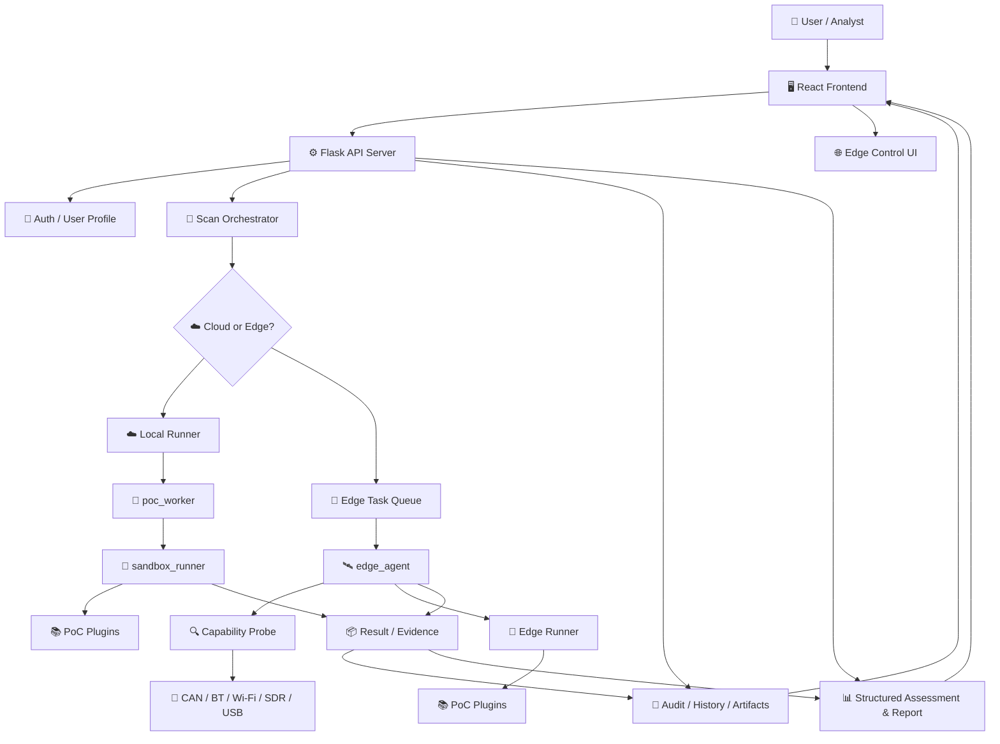

### 核心设计思想

- **UI 层**：负责参数录入、日志展示、审批确认、节点管理
- **API 层**：负责鉴权、参数归一化、执行调度、审计与持久化
- **Runner 层**：负责 PoC 沙箱执行、结果提取与统一输出
- **Edge 层**：负责现场硬件能力探测、本地执行、结果回传

---

## ⚙️ How It Works

你可以把系统理解成一条标准化执行管线：

`用户发起 -> 风险校验 -> 能力匹配 -> 选择执行平面 -> 运行 PoC -> 收集证据 -> 生成评估`

更具体一点：

1. 前端发起扫描或单个 PoC 执行
2. 后端解析参数并读取 PoC 元数据
3. 平台判断这个 PoC 是：
   - ☁️ 云端可执行
   - 📡 边端必需
   - 🧍 需要人工确认
4. 对高风险 PoC 先走审批链路
5. 由本地 Runner 或 Edge Agent 执行 PoC
6. 平台实时收集日志、提取结果、归一化证据
7. 结果落库，生成历史记录、结构化评估和报告

---

## 🌐 Why Edge Matters

很多 ICV PoC 天生不适合直接在云端跑。  
例如：

- USB 挂载 / USB OTG
- PCAN / SocketCAN
- 本地蓝牙适配器
- Monitor 模式 Wi-Fi 网卡
- HackRF / SDR
- 私有实验网、车载以太网、客户内网

因此系统采用 **Cloud + Edge** 模型：

- ☁️ **Cloud**：控制面，负责 UI、用户、调度、审计、报告
- 📡 **Edge**：执行面，负责贴近现场设备执行硬件敏感 PoC

---

## 🔥 Highlights

### 🛡️ 安全优先

高风险 PoC 不会“点一下就跑”，而是经过：

- 前端审批确认
- 后端二次强校验
- 审计日志落库

### 📡 云边一体

支持云端统一控制，在边缘节点执行 CAN / 蓝牙 / Wi-Fi / SDR / USB 相关能力。

### 🧱 工程化执行

不是简单同步调用，而是：

- `run_poc_stream` 实时日志回传
- 统一结果结构
- 扫描历史与证据沉淀

### 🧩 PoC 可扩展

所有 PoC 都遵循统一插件接口，新增 PoC 后可以自动接入：

- PoC 列表
- 参数校验
- 风险识别
- 日志输出
- 边云调度

### 🚗 面向 ICV 攻击面

PoC 按车联网常见攻击面组织：

- Reconnaissance
- Network
- CAN Bus
- Wireless
- Application
- Advanced

---

## 🖼️ Screenshots

### Dashboard

<div align="center">
  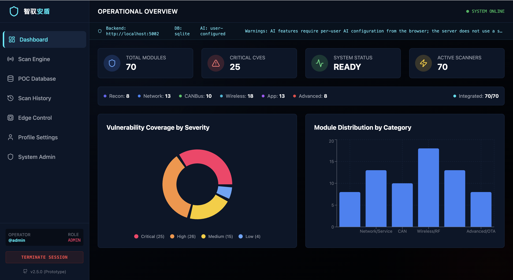
</div>

### Scan Engine

<div align="center">
  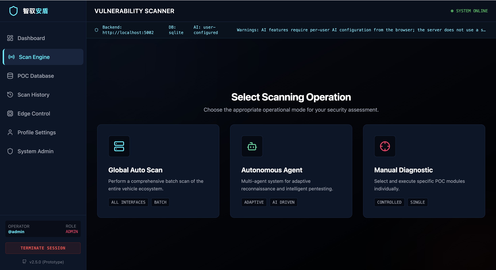
</div>

### Agent Scan

<div align="center">
  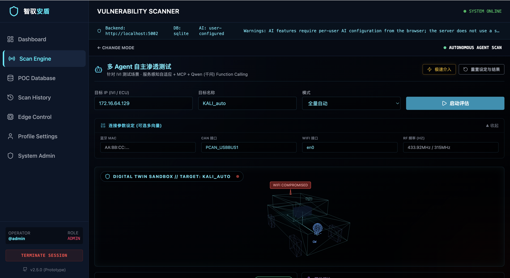
</div>
<div align="center">
  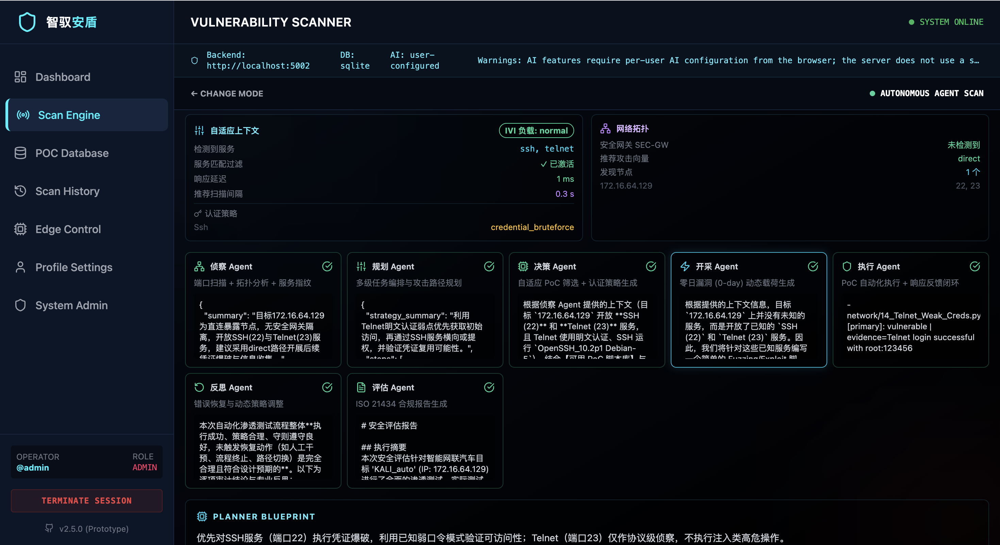
</div>
<div align="center">
  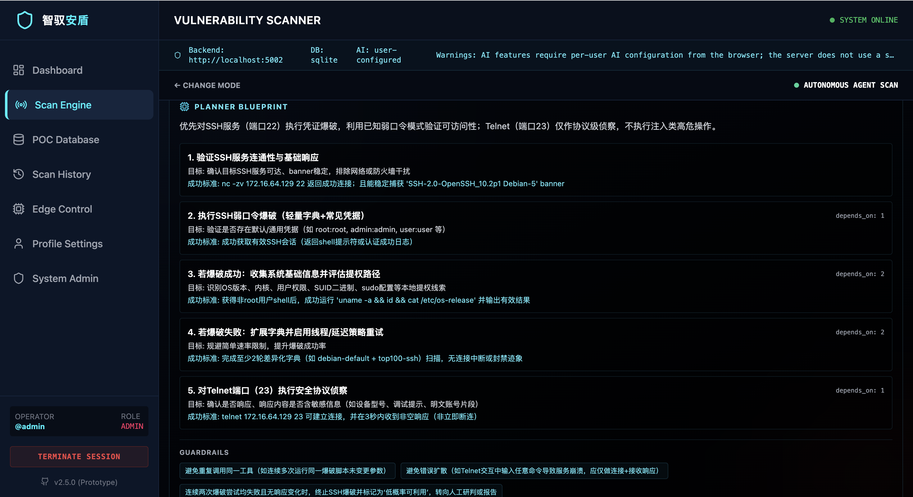
</div>
<div align="center">
  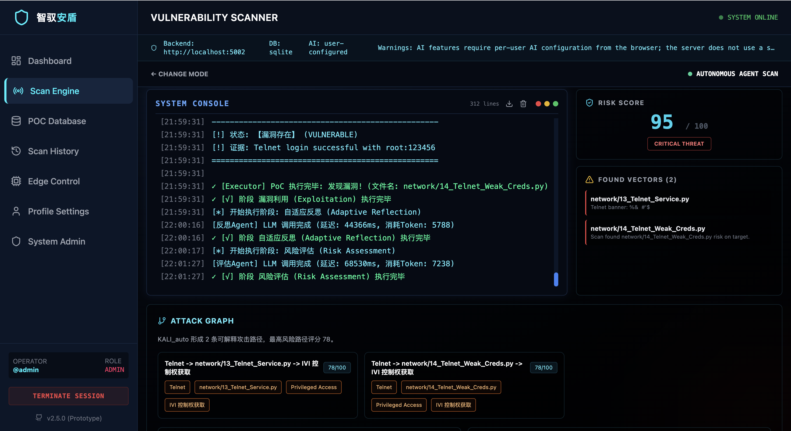
</div>
<div align="center">
  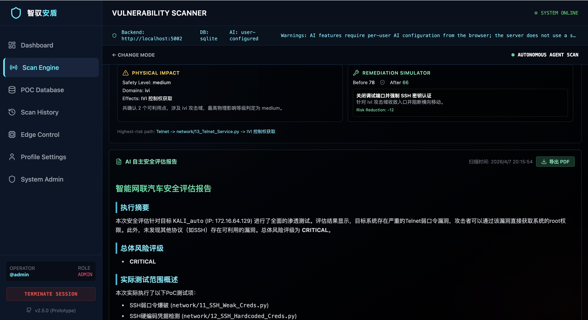
</div>

### PoC Database

<div align="center">
  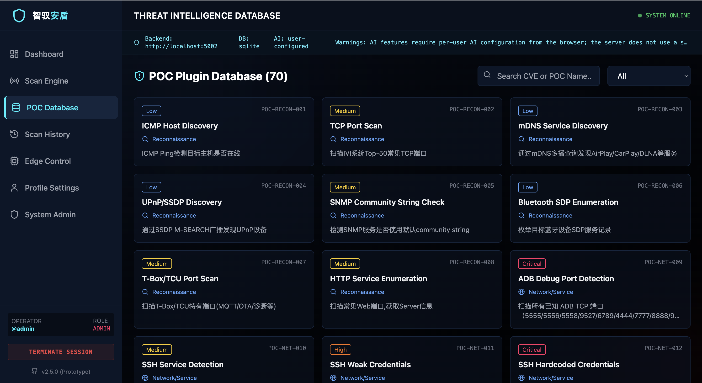
</div>

### Scan History

<div align="center">
  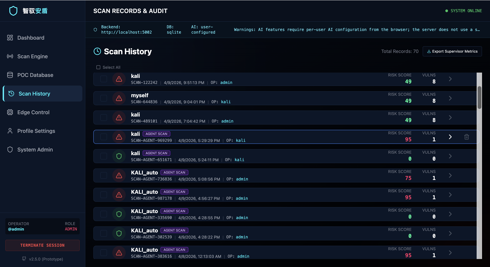
</div>
<div align="center">
  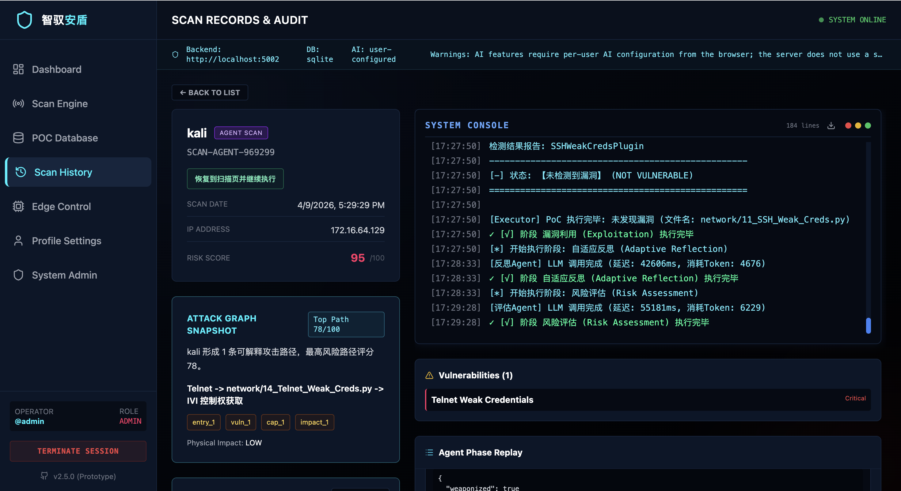
</div>
<div align="center">
  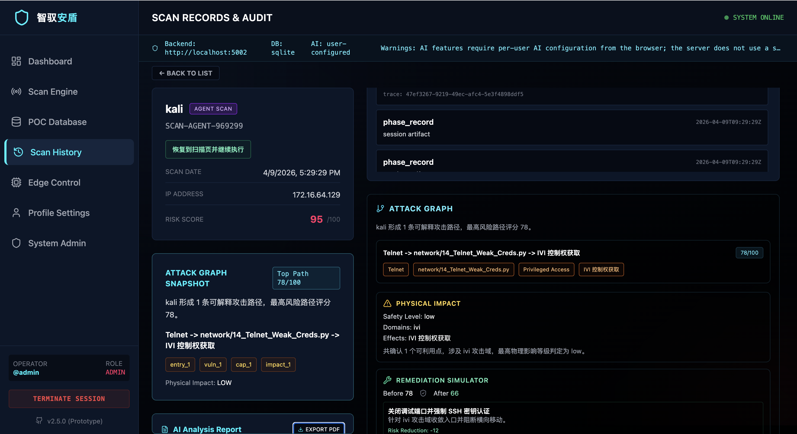
</div>

### Edge Control

<div align="center">
  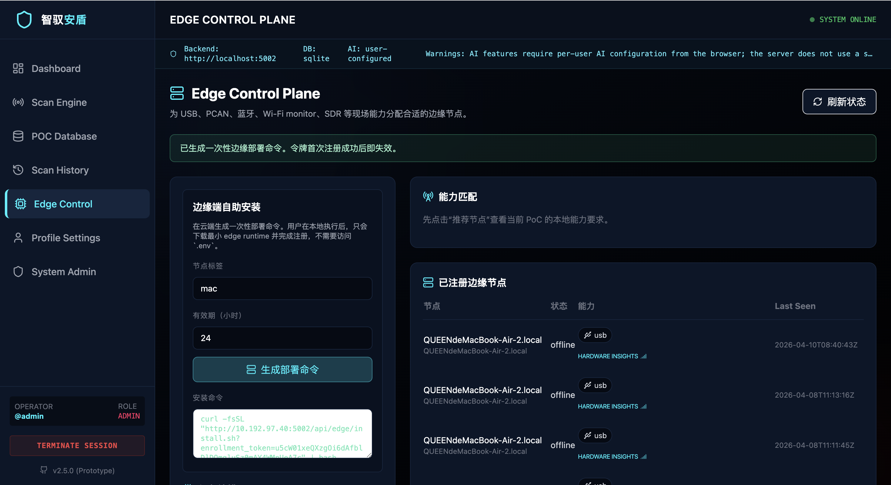
</div>
<div align="center">
  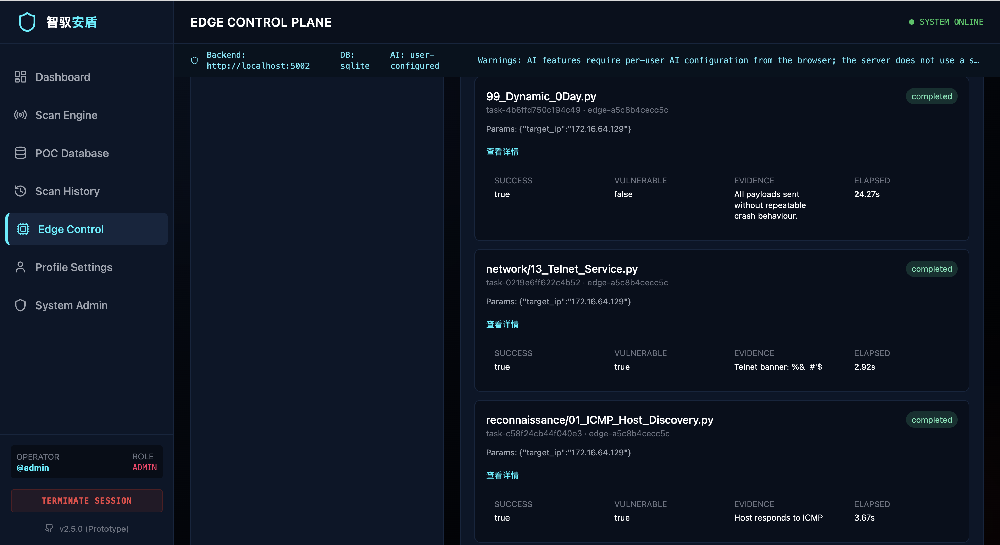
</div>

---

## 📦 Project Structure

```text
.
├── client/
│   ├── components/              # 前端页面与核心交互
│   ├── services/                # API 调用封装
│   ├── data/                    # 前端数据源
│   └── App.tsx
├── server/
│   ├── server.py                # 主 API 入口
│   ├── config.py                # 配置加载
│   ├── auth_service.py          # Bearer -> User 解析
│   ├── poc_execution_service.py # 参数归一化
│   ├── poc_security.py          # 风险识别与审批判定
│   ├── poc_worker.py            # PoC 计划与执行调度
│   ├── sandbox_runner.py        # 沙箱执行器
│   ├── edge_*.py                # Edge 能力、部署与调度模块
│   ├── benchmarks/
│   └── pocs/                    # PoC 插件目录
├── assets/
├── docs/
└── README.md
```

---

## 🔧 Configuration

`server/config.py` 会自动加载：

- 项目根目录 `.env`
- 项目根目录 `.env.local`
- `server/.env`
- `server/.env.local`

常用环境变量：

| 变量 | 默认值 | 说明 |
| --- | --- | --- |
| `AUTOSEC_SECRET_KEY` | 自动生成 | JWT 签名密钥 |
| `AUTOSEC_DB_URI` | 本地 SQLite | 数据库连接串 |
| `AUTOSEC_API` | `http://localhost:5002` | 主 API 地址 |
| `MCP_SERVER` | `http://localhost:5003` | MCP Server 地址 |
| `AUTOSEC_EDGE_RUNTIME_PATH` | 自动探测 | Edge Runtime 文件路径 |
| `AUTOSEC_EDGE_BUILD_DIR` | `build/edge_runtime` | Edge 构建输出目录 |
| `AUTOSEC_PUBLIC_HOST` | 空 | 强制指定 Edge 命令中的服务端地址 |
| `AUTOSEC_HOST` | `0.0.0.0` | Flask 监听地址 |
| `AUTOSEC_PORT` | `5002` | Flask 端口 |
| `AUTOSEC_DEBUG` | `false` | Debug 开关 |

推荐开发配置：

```env
AUTOSEC_SECRET_KEY=replace-with-a-long-random-string
AUTOSEC_DB_URI=sqlite:///server/autosec.db
AUTOSEC_API=http://localhost:5002
MCP_SERVER=http://localhost:5003
AUTOSEC_EDGE_BUILD_DIR=build/edge_runtime
AUTOSEC_PORT=5002
AUTOSEC_DEBUG=false
```

如果服务器存在多块网卡、VPN、代理或虚拟网桥，建议明确指定：

```env
AUTOSEC_PUBLIC_HOST=10.192.97.40
```

这样生成的 Edge 部署命令会始终使用你指定的地址。

---

## 📡 Edge Agent Setup

### 标准接入流程

1. 启动后端 `server.py`
2. 构建 Edge Runtime
3. 在前端生成一次性部署命令
4. 在边缘主机执行部署命令
5. 让 Edge Agent 进入 daemon 模式持续轮询

示例：

```bash
curl -fsSL "http://your-server:5002/api/edge/install.sh?enrollment_token=<TOKEN>" | bash
$HOME/.autosec-edge/autosec-edge --edge-api http://your-server:5002 --daemon
```

### Edge Agent 负责什么

- 上报节点硬件能力
- 接收云端任务
- 在本地执行 PoC
- 回传结果和日志

---

## 🔌 API Overview

### 基础执行

- `GET /api/health`
- `GET /api/list_pocs`
- `GET /api/poc-registry`
- `POST /api/fingerprint`
- `POST /api/run_poc`
- `POST /api/run_poc_stream`

### 评估与报告

- `POST /api/report/generate`
- `POST /api/attack-graph/generate`
- `POST /api/physical-impact/assess`
- `POST /api/remediation/simulate`
- `POST /api/report/structured`

### 历史与审计

- `POST /api/save_session`
- `GET /api/history`
- `DELETE /api/history/<id>`
- `POST /api/history/delete-batch`
- `GET /api/session-artifacts/<session_id>`
- `GET /api/supervisor-metrics`

### Agent 与 Edge

- `POST /api/topology`
- `POST /api/adaptive-context`
- `POST /api/agent-scan`
- `POST /api/edge/register`
- `POST /api/edge/heartbeat`
- `GET /api/edge/agents`
- `POST /api/edge/enrollment-tokens`
- `GET /api/edge/install.sh`
- `POST /api/edge/tasks`
- `GET /api/edge/tasks/next`
- `POST /api/edge/tasks/<task_id>/result`

---

## ❓ FAQ

### 1) 为什么云端扫不到客户内网目标？

因为云端不在客户私网内。  
实验网、车间网、车载以太网、蓝牙、CAN、Wi-Fi Monitor、SDR 等场景请走 Edge。

### 2) 为什么高风险 PoC 会被拒绝？

因为系统默认开启了审批与后端强校验。  
这不是 bug，而是安全策略。

### 3) 为什么有些 PoC 只能生成样本，不能自动确认漏洞？

部分 USB / OTA / 无线类 PoC 天生依赖：

- 现场硬件
- 实体接入
- 人工观察
- 目标系统侧日志

它们更适合“现场验证工装”，不是“纯自动确认器”。

### 4) 为什么 Edge 部署命令里的地址不对？

如果服务器有多块网卡、VPN、虚拟网桥，建议显式设置：

```env
AUTOSEC_PUBLIC_HOST=<你的服务端实际地址>
```

### 5) Agent Scan 不可用怎么办？

请检查：

- `server/mcp_server.py` 是否启动
- 用户是否已配置模型参数
- 模型接口网络是否可达

---

## ⚠️ Disclaimer

本项目仅可用于：

- 经授权的安全测试
- 实验室台架验证
- 教学、研究、演示与方法评估

禁止将其用于未授权目标、生产车辆或任何违反法律法规的场景。  
高风险 PoC 即使在实验环境中也应在审批、隔离和回滚预案完备的前提下执行。

---

<div align="center">
  SmartDrive Shield · Built for ICV Security Research & Authorized Testing
</div>
