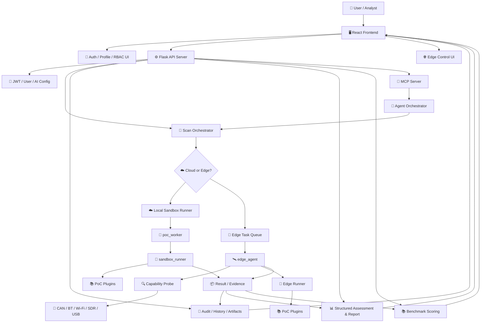

<div align="center">

# 🛡️ 智驭安盾
### SmartDrive Shield · 智能网联汽车漏洞扫描与安全评估平台

<p>
  
  
  
  
  
  
</p>

**智驭安盾（SmartDrive Shield）** 是一个面向智能网联汽车（ICV）的漏洞验证、攻击面分析、结构化评估与边云协同执行平台，涵盖一条从 **PoC 管理 → 风险控制 → 执行调度 → 结果沉淀 → 报告输出 → 评估回归** 的完整工程链路。

</div>

---

## ✨ Why This Project

在ICV安全测试中，通常存在现有问题：

- PoC 分散在脚本、笔记和临时目录里，执行方式不统一
- 高风险动作缺少审批、拦截和审计留痕
- CAN / 蓝牙 / Wi-Fi Monitor / SDR / USB OTG 等 PoC 依赖现场硬件，云端无法直接执行
- 扫描完成后，日志、证据、结构化结论和报告难以沉淀
- Agent 自动化扫描容易出现“计划、执行、评估”上下文断裂
- 结果质量缺少基准集，难以判断一次扫描是否覆盖了预期风险点

**智驭安盾** 的目标是把这些问题收束成一个统一平台：

- 🧠 **统一管理 71 个 PoC**，覆盖 6 类 ICV 攻击面
- 🛡️ **高风险 PoC 审批与审计留痕**，前后端双重校验
- 🌐 **云端控制 + 边端执行**，适配现场硬件与隔离网络
- 📊 **SSE 实时日志 + 历史记录 + 结构化评估**
- 🤖 **支持 Agent Scan 与 MCP 自动化协作扫描**
- 📚 **内置 Benchmark Suite**，可对扫描结果做回归评分
- 👤 **账号、角色、用户级 AI 配置**，适合多人实验环境

---

## 🚀 Quick Start

### 1) 准备环境

推荐环境：

- Python `3.10+`
- Node.js `18+`
- npm `9+`
- macOS / Linux 开发机
- 可选：CAN、蓝牙、Wi-Fi Monitor、SDR、USB Gadget 等现场硬件

复制环境变量模板：

```bash
cp .env.example .env
```

`.env.example` 已包含本地开发默认配置。生产或多人环境至少应设置稳定的 `AUTOSEC_SECRET_KEY`。

### 2) 启动后端

```bash
cd server
python3 -m venv .venv
source .venv/bin/activate
pip install -r requirements.txt
python3 server.py
```

默认后端地址：

- API: `http://localhost:5002`
- Health Check: `http://localhost:5002/api/health`
- 日志文件: `server/logs/autosec.log`
- 默认数据库: `server/autosec.db`

### 3) 启动前端

```bash
cd client
npm install
npm run dev
```

默认前端地址：

- Frontend: `http://localhost:3000`

前端会默认推断同主机的 `5002` 端口作为后端地址，也可以在 UI 中手动调整 Engine URL。

### 4) 首次登录

打开前端后先注册账号。系统支持：

- 普通用户注册 / 登录
- JWT 会话校验
- Profile 页面维护用户信息与 AI 模型配置
- 管理员用户管理接口与界面

> ⚠️ 开发环境允许从前端注册用户。部署到正式环境前，请结合网络隔离、初始管理员策略和反向代理访问控制进行加固。

### 5) 可选：启用 Agent Scan

Agent Scan 依赖 MCP Server。主 API 和 MCP Server 需要同时运行：

```bash
cd server
source .venv/bin/activate
python3 mcp_server.py
```

默认 MCP 地址：

- MCP Server: `http://localhost:5003`

> ✅ 到这里，你已经可以执行 Manual Scan / Global Scan / Edge Control。  
> ✅ 只有在使用 `Agent Scan` 或外部 Agent 工具调用时才必须启动 `mcp_server.py`。

---

## 🧭 First Run

第一次使用，推荐按下面路径跑一遍：

### Step A · 检查引擎

进入前端后确认：

- `Engine URL` 指向你的后端
- `Connection Test` 返回 `online`
- Dashboard 顶部没有关键运行时告警

### Step B · 配置 AI 能力

进入 `Profile` 页面配置用户级 AI 参数：

- `Base URL`：默认兼容 DashScope OpenAI-style 地址
- `API Key`：用户自己的模型 API Key
- `Report Model`：报告生成模型，默认 `qwen-max`
- `Fast Model`：快速分析模型，默认 `qwen-plus`
- `Strong Model`：复杂推理模型，默认 `qwen-max`

后端不会使用共享模型 Key。报告生成、Agent Scan、AI 配置测试会优先读取当前用户保存的加密配置。

### Step C · 填目标参数

最少填一个有效目标，常见参数包括：

- `IP Address`
- `Bluetooth MAC`
- `CAN Interface`
- `Wi-Fi Interface`
- `RF Frequency`

### Step D · 执行扫描

系统会自动完成：

1. 目标连通性检查
2. OS / 服务指纹识别
3. PoC 过滤与能力匹配
4. PoC 执行与实时日志输出
5. 风险汇总与历史落库
6. 结构化报告与证据归档

### Step E · 处理高风险 PoC

如果命中高风险动作，系统不会直接执行，而是要求人工确认：

- `Skip This PoC`
- `Confirm And Execute`
- `Confirm For Rest Of Scan`

### Step F · 看结果

扫描完成后可直接进入：

- `Scan History`
- `PoC Database`
- `Structured Report`
- `Edge Control`
- `Attack Graph`
- `Benchmark Evaluation`

---

## 🏗️ Architecture

当前项目采用 **React 前端 + Flask API + PoC Runner + MCP Agent + Edge Agent** 的分层架构：



### 核心设计思想

- **UI 层**：参数录入、日志展示、审批确认、节点管理、账号配置、历史回放
- **API 层**：鉴权、参数归一化、调度、审计、持久化、AI 配置加密
- **Runner 层**：PoC 沙箱执行、结果提取、统一输出、SSE 日志回传
- **Agent 层**：侦察、决策、动态探测、执行、评估的自动化协作流程
- **Edge 层**：现场硬件能力探测、本地 PoC 执行、结果回传
- **Evaluation 层**：基准样例、期望发现、攻击计划与执行质量评分

---

## ⚙️ How It Works

你可以把系统理解成一条标准化执行管线：

`用户发起 -> 身份校验 -> 风险校验 -> 能力匹配 -> 选择执行平面 -> 运行 PoC -> 收集证据 -> 生成评估 -> 历史回归`

更具体一点：

1. 前端发起扫描、单个 PoC 执行或 Agent Scan
2. 后端解析 JWT，加载用户、角色和用户级 AI 配置
3. 后端归一化目标参数，例如 IP、端口、CAN 接口、蓝牙 MAC、无线网卡
4. 平台读取 PoC 元数据，判断这个 PoC 是：
   - ☁️ 云端可执行
   - 📡 边端必需
   - 🧍 需要人工确认
5. 对高风险 PoC 先走审批链路，后端再次强校验
6. 由本地 Runner 或 Edge Agent 执行 PoC
7. 平台通过 SSE 实时收集日志，提取结果和证据
8. 结果落库，生成历史记录、结构化评估、攻击图和报告
9. 可选使用 Benchmark Suite 对结果进行回归评分

---

## 🤖 Agent Scan

Agent Scan 是平台的自动化协作扫描模式，由 `server/agent_orchestrator.py` 和 `server/mcp_server.py` 驱动。

### Agent 工作流

| Phase | 角色 | 主要职责 |
| --- | --- | --- |
| `recon` | Reconnaissance Agent | 拓扑扫描、端口服务识别、资产上下文整理 |
| `decision` | Decision Agent | 根据目标、接口、硬件能力和 PoC 元数据生成执行计划 |
| `weaponize` | Dynamic Probe Agent | 对未知服务生成协议感知型动态探测，输出候选异常证据 |
| `execute` | Executor Agent | 调度 PoC、处理边云路由、记录执行结果 |
| `assess` | Assessment Agent | 汇总证据，生成风险评分、发现列表和结构化结论 |

### 启动条件

Agent Scan 需要：

- Flask API 已启动
- MCP Server 已启动
- 用户 Profile 中已配置可用的 AI 参数
- `AUTOSEC_API` 指向主 API 地址
- `MCP_SERVER` 指向 MCP Server 地址

### 注意事项

- `99_Dynamic_Unknown_Service_Probe` 用于补足静态 PoC 无法覆盖的未知服务场景
- 动态探测输出的是候选异常证据，不会把单次连接失败直接等同于漏洞确认
- Agent Scan 可以恢复历史阶段记录，并从 Scan History 回到 Agent 页面查看上下文

---

## 🌐 Why Edge Matters

很多 ICV PoC 天生不适合直接在云端跑。  
例如：

- USB 挂载 / USB OTG
- PCAN / SocketCAN
- 本地蓝牙适配器
- Monitor 模式 Wi-Fi 网卡
- HackRF / SDR
- 私有实验网、车载以太网、客户内网

因此系统采用 **Cloud + Edge** 模型：

- ☁️ **Cloud**：控制面，负责 UI、用户、调度、审计、报告
- 📡 **Edge**：执行面，负责贴近现场设备执行硬件敏感 PoC

---

## 🔥 Highlights

### 🛡️ 安全优先

高风险 PoC 不会“点一下就跑”，而是经过：

- 前端审批确认
- 后端二次强校验
- 审计日志落库
- 结果与执行证据绑定

### 📡 云边一体

支持云端统一控制，在边缘节点执行 CAN / 蓝牙 / Wi-Fi / SDR / USB 相关能力。

### 🧱 工程化执行

不是简单同步调用，而是：

- `run_poc_stream` 实时日志回传
- 统一结果结构
- 扫描历史与证据沉淀
- 执行 Artifact 归档

### 🧩 PoC 可扩展

所有 PoC 都遵循统一插件接口，新增 PoC 后可以接入：

- PoC 列表
- 参数校验
- 风险识别
- 日志输出
- 边云调度
- 历史与报告

### 🚗 面向 ICV 攻击面

PoC 按车联网常见攻击面组织：

- Reconnaissance
- Network
- CAN Bus
- Wireless
- Application
- Advanced
- Dynamic Unknown Service

### 📚 可回归评估

Benchmark Suite 可从历史扫描样例中抽取期望结果，对一次扫描的发现、攻击计划、执行路径和风险评分做量化评估。

---

## 🧩 PoC Matrix

当前项目共内置 `71` 个 PoC，覆盖从基础侦察到高级无线与固件攻击面的完整研究链路。  
下面这张表用于快速理解各类 PoC 的定位、覆盖范围和典型执行方式。

| Category | Count | ID Range | Focus | Typical Examples | Execution |
| --- | ---: | --- | --- | --- | --- |
| Reconnaissance | 8 | `01-08` | 主机发现、端口扫描、服务枚举、基础资产摸排 | `ICMP Host Discovery` `TCP Port Scan` `mDNS/SSDP Discovery` | ☁️ Cloud / 📡 Edge |
| Network | 13 | `09-21` | 车机网络服务与常见中间件风险验证 | `ADB Debug Port` `SSH Weak Creds` `MQTT Unauth` `SOME/IP SD` | ☁️ Cloud 为主，局域网场景可走 📡 Edge |
| CAN Bus | 10 | `22-31` | CAN/UDS/OBD 相关协议交互、注入、重放、诊断访问 | `CAN Sniff` `CAN Injection` `UDS ReadMemory` `ECU Reset` | 📡 Edge |
| Wireless | 18 | `32-49` | Wi-Fi、Bluetooth、QNX 无线面、协议层攻击与接入控制 | `WiFi Deauth` `KRACK` `BlueBorne` `PerfektBlue` | 📡 Edge |
| Application | 13 | `50-62` | 车机应用、CarPlay/AirPlay、USB、WebView、媒体链路风险 | `AirPlay UAF` `USB SQLi` `WebView File Exfil` `Mirror Hijack` | ☁️ Cloud + 📡 Edge + 部分人工辅助 |
| Advanced | 8 | `63-70` | OTA、RF、GPS、TPMS、V2X、固件与升级链路高级验证 | `OTA MITM` `GPS Spoofing` `TPMS Spoofing` `Unsigned Firmware` | 📡 Edge / 硬件依赖 |
| Dynamic Unknown Service | 1 | `99` | 面向未知服务的协议感知型动态指纹与异常响应探测 | `Dynamic Unknown Service Probe` | ☁️ Cloud / 📡 Edge |

### 分类说明

- `Reconnaissance` 负责前置侦察，通常作为 `Global Scan` 和 `Agent Scan` 的入口阶段。
- `Network` 偏向车机系统和局域网服务面，适合验证开放服务、弱口令、匿名访问和服务发现风险。
- `CAN Bus` 和 `Wireless` 强依赖现场接口与硬件能力，是边云协同架构存在的核心原因。
- `Application` 覆盖车机生态中更接近用户侧和媒体链路侧的风险，部分场景需要人工配合完成最终验证。
- `Advanced` 主要面向更高复杂度攻击链，如 OTA、中继、V2X、RF、GPS 与固件更新链路。
- `99_Dynamic_Unknown_Service_Probe` 是未知服务动态探测 PoC，用于在 `Agent Scan` 中补足固定签名插件无法覆盖的服务场景；该模块输出候选异常证据，不将单次连接异常直接等同于漏洞确认。

### 当前 PoC 分布

| Group | Count |
| --- | ---: |
| Cloud-friendly | 约 32 |
| Edge-required | 约 32 |
| Manual-assisted | 约 6 |
| Dynamic / Experimental | 1 |

---

## 🖼️ Screenshots

### Dashboard

<div align="center">
  
</div>

### Scan Engine

<div align="center">
  
</div>

### Agent Scan

<div align="center">
  
</div>
<div align="center">
  
</div>
<div align="center">
  
</div>
<div align="center">
  
</div>
<div align="center">
  
</div>

### PoC Database

<div align="center">
  
</div>

### Scan History

<div align="center">
  
</div>
<div align="center">
  
</div>
<div align="center">
  
</div>

### Edge Control

<div align="center">
  
</div>
<div align="center">
  
</div>

---

## 📦 Project Structure

```text
.
├── client/
│   ├── components/
│   │   ├── Dashboard.tsx          # 全局态势大屏
│   │   ├── Scanner.tsx            # Manual / Global / Agent 扫描入口
│   │   ├── AgentScan.tsx          # Agent 阶段流、恢复与报告展示
│   │   ├── EdgeManager.tsx        # Edge 节点、令牌、部署命令与任务管理
│   │   ├── PocDatabase.tsx        # PoC 数据库与详情页
│   │   ├── ScanHistory.tsx        # 历史记录、报告、恢复 Agent 会话
│   │   ├── AuthPage.tsx           # 注册 / 登录
│   │   ├── Profile.tsx            # 用户资料与 AI 配置
│   │   └── UserManagement.tsx     # 管理员用户管理
│   ├── services/
│   │   ├── api.ts                 # 后端 API 调用、AI 配置载荷、Engine URL
│   │   └── LLMService.ts          # 前端侧 LLM 辅助服务
│   ├── data/pocDatabase.ts        # 前端 PoC 展示数据
│   ├── App.tsx                    # 应用状态与路由
│   ├── package.json
│   └── vite.config.ts
├── server/
│   ├── server.py                  # 主 Flask API 入口
│   ├── config.py                  # .env 加载与运行时配置
│   ├── auth_service.py            # Bearer Token -> User 解析
│   ├── agent_orchestrator.py      # Agent Scan 编排
│   ├── mcp_server.py              # MCP 工具服务
│   ├── assessment_engine.py       # 结构化评估、攻击图、修复模拟
│   ├── benchmark_suite.py         # Benchmark 评分逻辑
│   ├── poc_execution_service.py   # 参数归一化与目标标签解析
│   ├── poc_security.py            # 风险识别与审批判定
│   ├── poc_worker.py              # PoC 计划与执行调度
│   ├── sandbox_runner.py          # 子进程沙箱执行器
│   ├── edge_agent.py              # 边缘节点 Agent
│   ├── edge_deployment.py         # Edge 安装命令、运行时下载、地址解析
│   ├── edge_requirements.py       # PoC 边缘能力需求推断
│   ├── edge_capability_probe.py   # 现场硬件能力探测
│   ├── pocs/                      # 71 个 PoC 插件
│   └── benchmarks/                # 默认回归基准与样例会话
├── assets/                        # README 与演示截图
├── docs/                          # 项目报告与内部说明
├── .env.example                   # 环境变量模板
├── 功能说明.md                    # 中文功能说明书
└── README.md
```

---

## 🔧 Configuration

`server/config.py` 会按顺序加载：

- 项目根目录 `.env`
- 项目根目录 `.env.local`
- `server/.env`
- `server/.env.local`

常用环境变量：

| 变量 | 默认值 | 说明 |
| --- | --- | --- |
| `AUTOSEC_SECRET_KEY` | 自动生成 | JWT 签名密钥。未设置时每次重启可能导致旧 Token 失效 |
| `AUTOSEC_DB_URI` | `sqlite:///server/autosec.db` | 数据库连接串，支持 SQLite 和 SQLAlchemy 兼容 URI |
| `AUTOSEC_API` | `http://localhost:5002` | 主 API 地址，MCP Server 和 Edge Agent 会使用 |
| `MCP_SERVER` | `http://localhost:5003` | MCP Server 地址 |
| `AUTOSEC_HOST` | `0.0.0.0` | Flask 监听地址 |
| `AUTOSEC_PORT` | `5002` | Flask 端口 |
| `AUTOSEC_DEBUG` | `false` | Debug 开关 |
| `AUTOSEC_PUBLIC_HOST` | 空 | 强制指定 Edge 命令中的服务端地址 |
| `AUTOSEC_EDGE_RUNTIME_PATH` | 自动探测 | Edge Runtime 文件路径或多平台产物目录 |
| `AUTOSEC_EDGE_BUILD_DIR` | `build/edge_runtime` | Edge 构建输出目录 |
| `AUTOSEC_EDGE_INCLUDE_POC_CODE` | 空 | Edge Task 是否内联 PoC 代码 |
| `AUTOSEC_EDGE_STATE_FILE` | 用户目录默认路径 | Edge Agent 注册状态文件路径 |
| `AUTOSEC_EDGE_ENROLLMENT_TOKEN` | 空 | Edge Agent 注册令牌 |
| `AUTOSEC_POC_WORKER_MODE` | `local_sandbox` | PoC Worker 执行模式 |

推荐开发配置：

```env
AUTOSEC_SECRET_KEY=replace_with_a_long_random_secret
AUTOSEC_DB_URI=sqlite:///server/autosec.db
AUTOSEC_API=http://localhost:5002
MCP_SERVER=http://localhost:5003
AUTOSEC_HOST=0.0.0.0
AUTOSEC_PORT=5002
AUTOSEC_DEBUG=false
AUTOSEC_EDGE_RUNTIME_PATH=server/edge_dist/autosec-edge
```

如果服务器存在多块网卡、VPN、代理或虚拟网桥，建议明确指定：

```env
AUTOSEC_PUBLIC_HOST=10.192.97.40
```

这样生成的 Edge 部署命令会始终使用你指定的地址。

---

## 👤 Auth, Roles & AI Config

平台内置基础用户体系：

- `POST /api/register` 注册
- `POST /api/login` 登录
- `GET /api/profile` 获取当前用户
- `PUT /api/profile` 更新资料与 AI 配置
- `GET /api/admin/users` 管理员用户列表
- `POST /api/admin/users` 管理员创建用户
- `PUT /api/admin/users/<id>` 管理员更新用户
- `DELETE /api/admin/users/<id>` 管理员删除用户

AI 配置采用用户级存储：

- 前端 Profile 页面保存 `baseUrl`、`apiKey`、`reportModel`、`fastModel`、`strongModel`
- 后端会使用 `AUTOSEC_SECRET_KEY` 派生密钥，对用户 AI 配置加密后存入数据库
- `/api/report/generate`、`/api/agent-scan`、`/api/test-ai-config` 会优先使用请求体配置，未提供时读取当前用户配置

> ⚠️ 如果 `AUTOSEC_SECRET_KEY` 改变，历史加密 AI 配置可能无法解密。多人环境务必固定该变量。

---

## 📡 Edge Agent Setup

### 标准接入流程

1. 启动后端 `server.py`
2. 构建或准备 Edge Runtime
3. 在前端 `Edge Control` 生成一次性部署令牌与部署命令
4. 在边缘主机执行部署命令
5. 让 Edge Agent 进入 daemon 模式持续轮询

Linux / macOS 示例：

```bash
curl -fsSL "http://your-server:5002/api/edge/install.sh?enrollment_token=<TOKEN>" | bash
$HOME/.autosec-edge/autosec-edge --edge-api http://your-server:5002 --daemon
```

Windows PowerShell：

```powershell
powershell -ExecutionPolicy Bypass -Command "iwr 'http://your-server:5002/api/edge/install.ps1?enrollment_token=<TOKEN>' -UseBasicParsing | iex"
$env:USERPROFILE\.autosec-edge\autosec-edge.exe --edge-api http://your-server:5002 --daemon
```

Python 源码方式调试：

```bash
cd server
python3 edge_agent.py --register --edge-api http://your-server:5002 --enrollment-token <TOKEN>
python3 edge_agent.py --edge-api http://your-server:5002 --daemon
```

### 产品化多平台构建

Edge Runtime 是平台相关二进制，不能在 macOS 上直接生成可用于 Linux 或 Windows 的产物。生产环境建议使用私有 CI 在目标系统 runner 上分别构建，并将产物放入 `AUTOSEC_EDGE_RUNTIME_PATH` 指向的目录或默认 `build/edge_runtime` 目录。

标准产物命名：

```text
autosec-edge-linux-x86_64
autosec-edge-linux-arm64
autosec-edge-windows-x86_64.exe
autosec-edge-darwin-arm64
autosec-edge-darwin-x86_64
```

仓库提供两个构建入口：

```bash
python3 server/build_edge_runtime.py
python3 server/build_nuitka.py
```

商业分发优先使用 `nuitka` backend；`pyinstaller` backend 仅建议用于快速诊断。Linux ARM64 产物需要 ARM64 runner，例如 GitHub hosted ARM runner 或私有树莓派 / ARM 云主机 self-hosted runner。

### Edge Agent 负责什么

- 上报节点硬件能力
- 接收云端任务
- 在本地执行 PoC
- 回传结果和日志
- 让云端无法触达的私有网、CAN、蓝牙、Wi-Fi、SDR 场景可以被统一调度

---

## 📚 Benchmark & Evaluation

项目内置 Benchmark Suite，用于评估一次扫描结果是否覆盖预期发现、攻击计划和执行证据。

### 相关文件

```text
server/benchmarks/default_suite.json
server/benchmarks/regression_suite.json
server/benchmarks/sample_session.json
server/benchmarks/fixtures/
server/benchmark_suite.py
server/run_benchmark_suite.py
server/generate_benchmark_suite.py
server/validate_benchmark_suite.py
```

### 命令行用法

校验 Benchmark Suite：

```bash
cd server
python3 validate_benchmark_suite.py
```

运行回归评分：

```bash
cd server
python3 run_benchmark_suite.py --strict
```

从 fixture 重新生成基准：

```bash
cd server
python3 generate_benchmark_suite.py
```

### API 用法

- `GET /api/evaluation/benchmarks`
- `POST /api/evaluation/score`
- `POST /api/evaluation/run-suite`

评分维度包括：

- 期望漏洞发现是否命中
- 攻击计划是否包含关键步骤
- 执行结果是否覆盖关键 PoC
- 风险评分是否达到基准阈值
- 是否出现禁止项或明显误报

---

## 🔌 API Overview

### 认证与用户

- `POST /api/register`
- `POST /api/login`
- `GET /api/profile`
- `PUT /api/profile`
- `GET /api/admin/users`
- `POST /api/admin/users`
- `PUT /api/admin/users/<user_id>`
- `DELETE /api/admin/users/<user_id>`

### 基础执行

- `GET /api/health`
- `GET /api/list_pocs`
- `GET /api/poc-registry`
- `POST /api/fingerprint`
- `POST /api/run_poc`
- `POST /api/run_poc_stream`
- `POST /api/execute`

### 评估与报告

- `POST /api/report/generate`
- `POST /api/attack-graph/generate`
- `POST /api/physical-impact/assess`
- `POST /api/remediation/simulate`
- `POST /api/report/structured`
- `POST /api/test-ai-config`

### 历史与审计

- `POST /api/save_session`
- `GET /api/history`
- `DELETE /api/history/<id>`
- `POST /api/history/delete-batch`
- `GET /api/session-artifacts/<session_id>`
- `GET /api/supervisor-metrics`

### Agent 与拓扑

- `POST /api/topology`
- `POST /api/adaptive-context`
- `POST /api/agent-scan`

### Edge

- `POST /api/edge/register`
- `POST /api/edge/heartbeat`
- `GET /api/edge/agents`
- `POST /api/edge/enrollment-tokens`
- `GET /api/edge/enrollment-tokens`
- `DELETE /api/edge/enrollment-tokens/<token_id>`
- `GET /api/edge/install.sh`
- `GET /api/edge/install.ps1`
- `GET /api/edge/runtime/download`
- `POST /api/edge/recommendations`
- `POST /api/edge/route-check`
- `POST /api/edge/tasks`
- `GET /api/edge/tasks`
- `GET /api/edge/tasks/next`
- `GET /api/edge/tasks/<task_id>/payload`
- `POST /api/edge/tasks/<task_id>/result`

### Evaluation

- `GET /api/evaluation/benchmarks`
- `POST /api/evaluation/score`
- `POST /api/evaluation/run-suite`

---

## 🧪 Development Commands

### 前端

```bash
cd client
npm install
npm run dev
npm run build
npm run preview
```

### 后端

```bash
cd server
python3 -m venv .venv
source .venv/bin/activate
pip install -r requirements.txt
python3 server.py
python3 mcp_server.py
```

### PoC 与能力报告

```bash
cd server
python3 audit_pocs.py
python3 smoke_test_pocs.py
python3 generate_poc_registry.py
python3 generate_poc_capability_report.py
```

### Benchmark

```bash
cd server
python3 validate_benchmark_suite.py
python3 run_benchmark_suite.py --strict
```

---

## 🧯 Safety Model

平台将 PoC 分为不同执行风险和执行平面：

- **Cloud-friendly**：可在主 API 所在机器安全执行的网络类或非破坏性验证
- **Edge-required**：依赖现场硬件或私有网络的 PoC
- **Manual-assisted**：需要人工观察、物理交互或外部环境配合
- **Disruptive / High-risk**：可能触发 DoS、总线注入、重放、复位、固件链路验证等动作

安全机制包括：

- PoC 风险元数据提取
- 高风险动作前端确认
- 后端强制审批校验
- 审计日志与执行历史落库
- Edge 能力缺失时拒绝或路由调整
- 结构化证据与最终判断分离

> ⚠️ 即使系统提供非破坏性默认策略，高风险 PoC 仍只能在授权、隔离、可回滚的实验环境中执行。

---

## ❓ FAQ

### 1) 为什么云端扫不到客户内网目标？

因为云端不在客户私网内。  
实验网、车间网、车载以太网、蓝牙、CAN、Wi-Fi Monitor、SDR 等场景请走 Edge。

### 2) 为什么高风险 PoC 会被拒绝？

因为系统默认开启了审批与后端强校验。  
这不是 bug，而是安全策略。

### 3) 为什么有些 PoC 只能生成样本，不能自动确认漏洞？

部分 USB / OTA / 无线类 PoC 天生依赖：

- 现场硬件
- 实体接入
- 人工观察
- 目标系统侧日志

它们更适合“现场验证工装”，不是“纯自动确认器”。

### 4) 为什么 Edge 部署命令里的地址不对？

如果服务器有多块网卡、VPN、虚拟网桥，建议显式设置：

```env
AUTOSEC_PUBLIC_HOST=<你的服务端实际地址>
```

### 5) Agent Scan 不可用怎么办？

请检查：

- `server/server.py` 是否启动
- `server/mcp_server.py` 是否启动
- `AUTOSEC_API` 是否指向主 API
- `MCP_SERVER` 是否指向 MCP Server
- 用户 Profile 是否已配置模型参数
- 模型接口网络是否可达
- `/api/test-ai-config` 是否返回成功

### 6) 为什么重启后登录状态失效？

如果未设置 `AUTOSEC_SECRET_KEY`，后端会生成临时密钥。服务重启后旧 JWT 会失效。  
请在 `.env` 中固定：

```env
AUTOSEC_SECRET_KEY=replace_with_a_long_random_secret
```

### 7) 为什么 AI 配置解密失败？

用户 AI 配置使用 `AUTOSEC_SECRET_KEY` 派生密钥加密。  
如果密钥变更，历史配置可能无法解密，需要用户重新保存 Profile 配置。

### 8) 如何新增 PoC？

推荐流程：

1. 在 `server/pocs/<category>/` 下新增 Python PoC
2. 遵循现有插件接口和结果结构
3. 在 PoC 内声明清晰的参数、风险、能力需求和执行日志
4. 运行 `python3 server/generate_poc_registry.py`
5. 运行 `python3 server/smoke_test_pocs.py`
6. 在前端 PoC Database 中确认展示与筛选正常

---

## ⚠️ Disclaimer

本项目仅可用于：

- 经授权的安全测试
- 实验室安全验证
- 教学、研究、演示与方法评估
- 合规审计前的内部验证

禁止将其用于未授权目标、生产车辆或任何违反法律法规的场景。  
高风险 PoC 即使在实验环境中也应在审批、隔离和回滚预案完备的前提下执行。

---

<div align="center">
  SmartDrive Shield · Built for ICV Security Research & Authorized Testing
</div>
