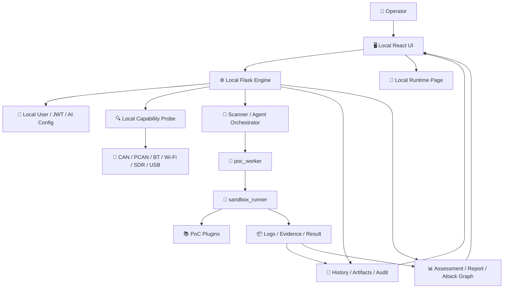

<div align="center">

# 🛡️ 智驭安盾
### SmartDrive Shield Edge · 智能网联汽车边缘端漏洞验证工作站

<p>
  
  
  
  
  
  
</p>

**智驭安盾（SmartDrive Shield Edge）** 是一款运行在测试人员本机、实验室工控机或车端测试工作站上的智能网联汽车（ICV）漏洞验证产品。在 **本机安装、本机连接车辆/台架、本机执行 PoC、本机沉淀证据、本机生成报告** 的边缘端安全验证工作站。

</div>

---

## ✨ Why Edge Workstation

智能网联汽车漏洞验证天然依赖现场资源：

- CAN / PCAN / SocketCAN 适配器
- 本地蓝牙控制器
- 支持 Monitor / Injection 的 Wi-Fi 网卡
- SDR / HackRF / RTL-SDR
- USB / USB Gadget / 车机物理接口
- 车载以太网、实验室私有网和隔离台架网络

因此，本项目现在按 **边缘端产品** 组织：

- 🧪 **本机执行 71 个 PoC**，不依赖远端节点调度
- 🔌 **本机硬件能力检测**，展示 USB、CAN、PCAN、蓝牙、Wi-Fi、SDR 状态
- 🛡️ **高风险 PoC 审批与后端强校验**
- 🧱 **本机沙箱 Runner**，限制 CPU、内存、输出大小、文件句柄和访问目标
- 📊 **本地历史记录、证据、攻击图、物理影响和报告**
- 🤖 **可选 Agent Scan / MCP**，仍在本机服务内运行
- 👤 **本地用户体系与用户级 AI 配置**

---

## 🚀 Quick Start

### 1) 准备环境

推荐环境：

- Python `3.10+`
- Node.js `18+`
- npm `9+`
- Linux / macOS / Windows
- 硬件类 PoC 推荐 Linux：SocketCAN、BlueZ、Wi-Fi Monitor、SDR、USB 权限更完整

复制配置：

```bash
cp .env.example .env
```

### 2) 启动本机检测引擎

```bash
cd server
python3 -m venv .venv
source .venv/bin/activate
pip install -r requirements.txt
python3 server.py
```

默认地址：

- Local Engine: `http://127.0.0.1:5002`
- Health Check: `http://127.0.0.1:5002/api/health`
- Local Capability: `http://127.0.0.1:5002/api/local/capabilities`
- SQLite: `server/autosec.db`
- Log: `server/logs/autosec.log`

### 3) 启动前端

```bash
cd client
npm install
npm run dev
```

打开：

- Frontend: `http://localhost:3000`

### 4) 可选：启用 Agent Scan

```bash
cd server
source .venv/bin/activate
python3 mcp_server.py
```

Agent Scan 仍然是本机产品的一部分，只是需要额外启动本机 MCP Server：

- MCP Server: `http://127.0.0.1:5003`

---

## 🧭 First Run

1. 注册并登录本地账号。
2. 进入 `Local Runtime`，点击“刷新本机能力”。
3. 检查 USB、CAN、PCAN、蓝牙、Wi-Fi、SDR 是否被识别。
4. 进入 `Scan Engine`，填写目标 IP、蓝牙 MAC、CAN Interface、Wi-Fi Interface 或 RF Frequency。
5. 执行 Manual Scan / Global Scan / Agent Scan。
6. 高风险 PoC 会弹出确认，不会默认静默执行。
7. 扫描完成后进入 `Scan History` 查看证据、报告和结构化结果。

---

## 🏗️ Architecture

当前产品按边缘端本地工作站组织：



### 核心原则

- **本机就是执行面**：所有扫描动作默认在当前工作站执行。
- **Local Runtime 只做本机能力检测**：不再作为远端 Edge 节点控制台。
- **硬件类 PoC 不再排队到远端节点**：Global Scan 和 Manual Scan 会通过本机 Runner 执行。

---

## 🔌 Local Runtime

前端 `Local Runtime` 页面调用：

- `GET /api/local/capabilities`

后端使用 `server/local_capability_probe.py` 探测本机能力，输出：

- 本机网络范围
- `lsusb`、`ip`、`iw`、`bluetoothctl`、`hciconfig`、`hackrf_info`、`rtl_test`
- `python-can` 可用配置
- USB 挂载候选
- PCAN 字符设备
- SocketCAN 接口
- Wi-Fi 接口
- 蓝牙控制器
- SDR 状态

并归一化为能力标志：

- `usb`
- `can`
- `pcan`
- `wifi`
- `bluetooth`
- `sdr`

---

## 🧩 PoC Matrix

当前内置 `71` 个业务 PoC：

| Category | Count | ID Range | Focus | 本机依赖 |
| --- | ---: | --- | --- | --- |
| Reconnaissance | 8 | `01-08` | 主机发现、端口扫描、服务枚举 | 网络可达 |
| Network | 13 | `09-21` | ADB、SSH、FTP、MQTT、SOME/IP 等 | 网络可达 |
| CAN Bus | 10 | `22-31` | CAN、UDS、OBD、注入、重放、诊断访问 | CAN / PCAN / SocketCAN |
| Wireless | 18 | `32-49` | Wi-Fi、Bluetooth、QNX 无线面 | Wi-Fi / Bluetooth |
| Application | 13 | `50-62` | 车机应用、AirPlay、CarPlay、USB、WebView | 网络 / USB / 人工辅助 |
| Advanced | 8 | `63-70` | OTA、RF、GPS、TPMS、V2X、固件 | SDR / RF / USB / 台架 |
| Dynamic Unknown Service | 1 | `99` | 未知服务动态探测 | 网络可达 |

---

## 🛡️ Safety Model

车端 PoC 可能造成 DoS、复位、总线注入或目标异常，因此系统保留安全控制：

- AST 提取 PoC 元数据和破坏等级
- `is_disruptive` / `meta_destructive_level` 风险判断
- 高风险 PoC 前端确认
- 后端二次拦截
- 本机沙箱进程执行
- CPU / 内存 / 输出 / 文件句柄限制
- 网络访问白名单默认绑定目标地址
- 执行日志、错误、证据和 trace_id 结构化保存

---

## 📦 Project Structure

```text
.
├── client/
│   ├── components/
│   │   ├── Dashboard.tsx
│   │   ├── Scanner.tsx
│   │   ├── ManualTestModal.tsx
│   │   ├── AgentScan.tsx
│   │   ├── LocalRuntime.tsx       # 本机能力与本机 PoC 快速验证
│   │   ├── PocDatabase.tsx
│   │   ├── ScanHistory.tsx
│   │   ├── AuthPage.tsx
│   │   └── Profile.tsx
│   ├── services/api.ts
│   └── package.json
├── server/
│   ├── server.py                  # 本机 Flask 检测引擎
│   ├── local_capability_probe.py  # 本机硬件能力探测
│   ├── poc_security.py            # PoC 安全画像
│   ├── poc_worker.py              # 本机 PoC Worker
│   ├── sandbox_runner.py          # 本机沙箱 Runner
│   ├── assessment_engine.py
│   ├── agent_orchestrator.py
│   ├── mcp_server.py
│   ├── pocs/
│   └── benchmarks/
├── assets/
├── docs/
├── .env.example
└── README.md
```

---

## 🔧 Configuration

`.env.example` 当前按本地边缘端工作站配置：

```env
AUTOSEC_SECRET_KEY=replace_with_a_long_random_secret
AUTOSEC_DB_URI=sqlite:///server/autosec.db
AUTOSEC_API=http://localhost:5002
MCP_SERVER=http://localhost:5003
AUTOSEC_HOST=0.0.0.0
AUTOSEC_PORT=5002
AUTOSEC_DEBUG=false
```

说明：

- `AUTOSEC_API` 仍用于本机 Agent / MCP 调用主 API。
- `MCP_SERVER` 仍用于本机 Agent Scan。
- 旧的远端 Edge Agent / task queue 路径已移除，当前产品只保留本地工作站执行面。

---

## 🖥️ Packaging Direction

产品化时打包完整本机工作站：

- Flask API
- React `dist`
- 内置 PoC 注册表
- 本机能力探测
- 本机沙箱 Runner
- SQLite 数据库初始化
- 一键启动器

当前仓库已经提供边缘端工作站发行包脚本：

```bash
python3 packaging/build_edge_workstation.py
```

默认使用 `PyInstaller`，这是当前最实用的交付路径。脚本会自动完成：

- 构建 React 前端，生成 `client/dist`
- 生成 `server/generated_poc_registry.py`，把 PoC 代码嵌入发行版
- 将 Flask 本机检测引擎、沙箱 Runner、本机能力探测和必要依赖打成可执行文件
- 组装客户交付目录和 zip 压缩包

当前 macOS arm64 本机验证产物：

```text
build/edge_workstation/release/autosec-guard-edge-macos-arm64/
├── autosec-guard-edge
├── start.sh
├── .env.template
└── README_RUNTIME.md

build/edge_workstation/release/autosec-guard-edge-macos-arm64.zip
```

启动发行版：

```bash
cd build/edge_workstation/release/autosec-guard-edge-macos-arm64
cp .env.template .env
./start.sh
```

打开：

```text
http://127.0.0.1:5002
```

如需更强源码保护，可以手动启用 Nuitka：

```bash
python3 packaging/build_edge_workstation.py --backend nuitka
```

注意：Nuitka 对 Scapy / python-can 这类依赖的首次编译非常慢，更适合作为正式商业发布前的加固构建，不建议作为日常调试默认方案。

### GitHub Actions 三平台打包

仓库内新增完整工作站发行 workflow：

```text
.github/workflows/edge-workstation-release.yml
```

它会在独立 runner 上分别构建：

- `linux-x64`
- `windows-x64`
- `macos-arm64`

触发方式：

- 手动触发：GitHub Actions 页面运行 `Edge Workstation Release`
- 打 tag 自动触发：

```bash
git tag v1.0.0
git push origin v1.0.0
```

CI 会执行：

- 安装 Python / Node.js 依赖
- 构建 React 前端
- 生成嵌入式 PoC 注册表
- 打包完整边缘端工作站
- 启动发行版做 `/api/health`、`/api/list_pocs` 和首页 smoke test
- 上传三平台 zip 产物
- tag 触发时自动把 zip 上传到 GitHub Release

发布给客户时只分发 CI 产出的 zip / 安装包，不分发仓库源码。仓库保持私有即可，GitHub Release 页面不需要对客户公开。

推荐最终交付形态：

| Platform | Package | 说明 |
| --- | --- | --- |
| Linux | `.deb` / `.rpm` / AppImage / tar.gz | 最适合 CAN、BlueZ、Wi-Fi Monitor、SDR |
| Windows | `.msi` / `.exe` | 适合网络类、PCAN、部分 USB |
| macOS | `.app` / `.pkg` | 适合 UI、网络类、部分 USB；底层无线能力受限 |

---

## 🔌 API Overview

### 本地运行时

- `GET /api/health`
- `GET /api/local/capabilities`

### PoC 执行

- `GET /api/list_pocs`
- `GET /api/poc-registry`
- `POST /api/fingerprint`
- `POST /api/run_poc`
- `POST /api/run_poc_stream`
- `POST /api/execute`

### 报告与评估

- `POST /api/report/generate`
- `POST /api/report/structured`
- `POST /api/attack-graph/generate`
- `POST /api/physical-impact/assess`
- `POST /api/remediation/simulate`

### 历史与审计

- `POST /api/save_session`
- `GET /api/history`
- `DELETE /api/history/<id>`
- `POST /api/history/delete-batch`
- `GET /api/session-artifacts/<session_id>`

### Agent Scan

- `POST /api/topology`
- `POST /api/adaptive-context`
- `POST /api/agent-scan`
- `POST /api/test-ai-config`

---

## 🧪 Development Commands

```bash
cd server
python3 server.py
```

```bash
cd client
npm run dev
npm run build
```

```bash
cd server
python3 mcp_server.py
python3 validate_benchmark_suite.py
python3 run_benchmark_suite.py --strict
```

---

## ❓ FAQ

### 1) 产品形态是什么吗？

当前主产品路径是本地边缘端工作站，默认 UI 和扫描流程只依赖本机执行引擎。

### 2) 为什么硬件能力没识别到？

请检查本机驱动和权限。例如 Linux 下需要 SocketCAN / BlueZ / `iw` / `lsusb` / SDR 工具；Windows 需要对应 PCAN 或 USB 驱动；macOS 的底层 Wi-Fi / 蓝牙能力会受系统限制。

### 3) 硬件类 PoC 现在怎么执行？

直接由本机 `poc_worker.py` 和 `sandbox_runner.py` 执行。执行前先在 `Local Runtime` 页面确认本机能力。

### 4) Agent Scan 是否还可用？

可用。它作为本机 Agent Scan 能力保留，需要启动本机 `mcp_server.py` 并配置用户级 AI 参数。

---

## ⚠️ Disclaimer

本项目仅可用于：

- 经授权的智能网联汽车安全测试
- 实验室台架验证
- 教学、研究、演示与方法评估
- 合规审计前的内部验证

禁止用于未授权目标、生产车辆或任何违反法律法规的场景。<br>
高风险 PoC 即使在实验环境中也应在隔离、审批和回滚预案完备的前提下执行。

---

<div align="center">
  SmartDrive Shield Edge · Local-first ICV Security Workstation
</div>
